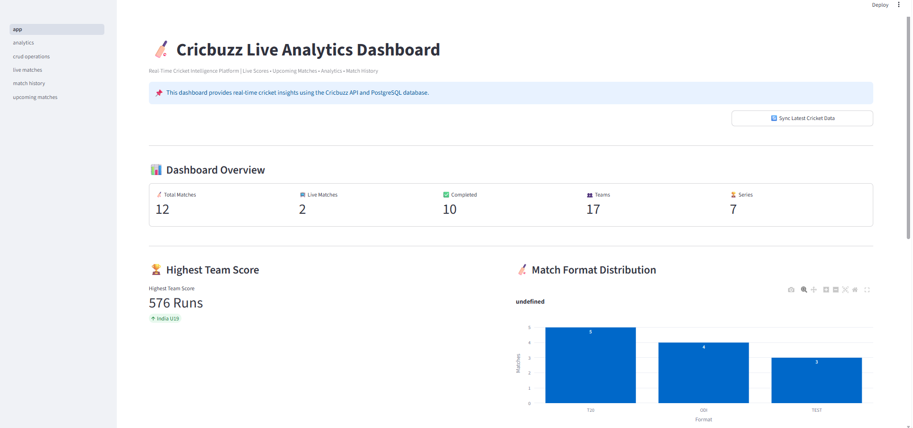
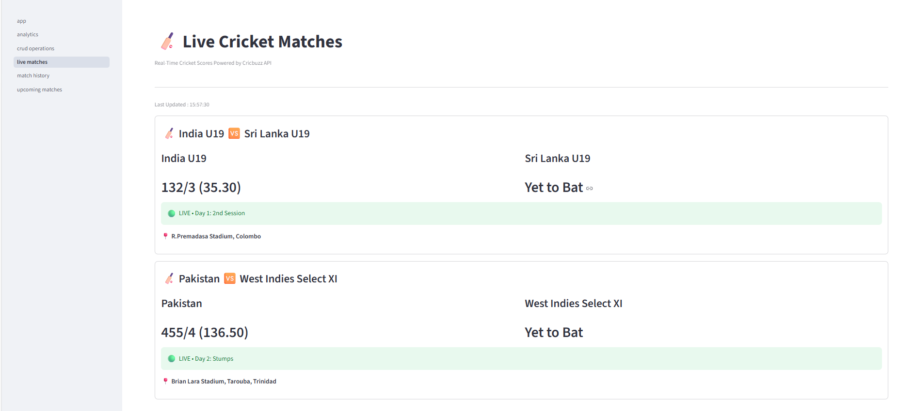
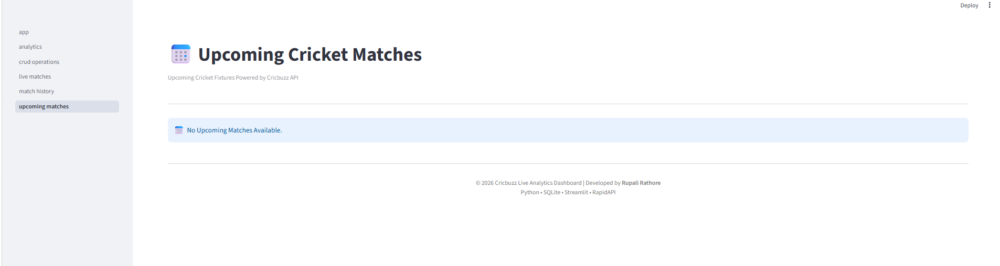
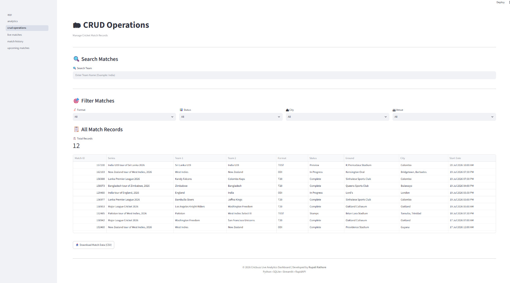
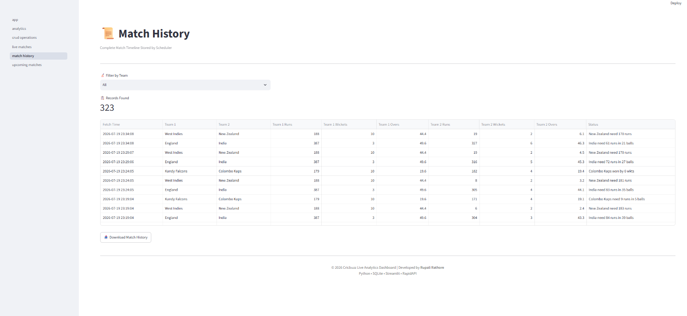
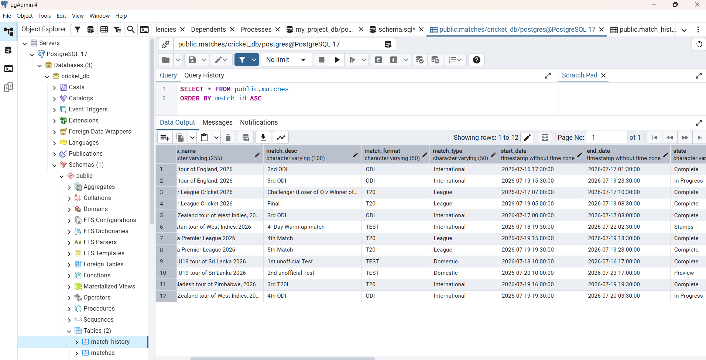

# 🏏 Cricbuzz LiveStats Dashboard


---

# 📌 Project Overview

Cricbuzz LiveStats Dashboard is a real-time cricket analytics application developed using **Python, Streamlit, PostgreSQL, SQL, Plotly, and Cricbuzz RapidAPI**.

The application fetches live and upcoming cricket match data from the Cricbuzz API, stores it in a PostgreSQL database, maintains match history, performs SQL-based analytics, and presents insights through an interactive Streamlit dashboard.

This project demonstrates complete Data Analytics workflow including:

- Data Collection
- Data Storage
- Data Processing
- SQL Analytics
- Interactive Dashboard
- CRUD Operations

---

# 🎯 Project Objectives

- Fetch Live Cricket Data using Cricbuzz API
- Fetch Upcoming Match Data
- Store Data in PostgreSQL
- Maintain Match History
- Perform SQL Analytics
- Build Interactive Dashboard
- Implement CRUD Operations
- Visualize Cricket Statistics

---

# ✨ Features

## 🏠 Dashboard

- Total Matches
- Live Matches
- Completed Matches
- Total Teams
- Total Series
- Highest Team Score
- Match Format Distribution
- Match Status Distribution
- Top Match Venues
- Sync Latest Cricket Data

---

## 🏏 Live Matches

- Live Scoreboard
- Team Scores
- Overs
- Match Status
- Ground & City
- Dashboard-based Data Synchronization
- Real-Time Database Updates
---

## 📅 Upcoming Matches

- Upcoming Fixtures
- Match Format
- Match Start Time
- Venue Details
- Series Information
- Dashboard-based Data Synchronization

---

## 📜 Match History

- Scheduler Generated Match History
- Team-wise Filtering
- Download Match History (CSV)

---

## 🗂 CRUD Operations

- Search Matches by Team
- Filter by Match Format
- Filter by Match Status
- Filter by City
- Filter by Venue
- Export Match Records

---

## 📊 Analytics

- Match Status Analysis
- Match Format Analysis
- Highest Team Scores
- Top Teams
- Top Venues
- Top Cities
- SQL Result Tables

---

# 🛠 Tech Stack

- **Programming Language:** Python
- **Frontend:** Streamlit
- **Database:** PostgreSQL
- **Query Language:** SQL
- **Data Processing:** Pandas
- **Data Visualization:** Plotly Express
- **API Integration:** Cricbuzz RapidAPI (REST API)
- **Version Control:** Git & GitHub
- **Development Environment:** Visual Studio Code

---

# 📂 Project Structure

```text
Cricbuzz-LiveStats
│
├── analytics/
│   ├── crud_queries.py
│   ├── dashboard_queries.py
│   ├── history_queries.py
│   ├── live_queries.py
│   ├── stats_queries.py
│   └── upcoming_queries.py
│
├── api/
│   ├── cricbuzz_api.py
│   └── upcoming_api.py
│
├── assets/
│   └── screenshots/ 
|        ├── dashboard.png
|        ├── live_matches.png
|        ├── upcoming_matches.png
|        ├── analytics_1.png
|        ├── analytics_2.png
|        ├── crud.png
|        ├── history.png
|        ├── database.png
│
├── data/
│   ├── live_matches.json
│   └── upcoming_matches.json
│
├── database/
│   ├── database.py
│   ├── history_queries.py
│   ├── match_queries.py
│   └── schema.sql
|
│── documentation/
│   └── CRICKET LIVE ANALYTICS DASHBOARD USING CRICBUZZ API.docx
|
├── pages/
│   ├── analytics.py
│   ├── crud_operations.py
│   ├── live_matches.py
│   ├── match_history.py
│   └── upcoming_matches.py
│
├── utils/
│   ├── footer.py
│   ├── parser.py
│   └── upcoming_parser.py
│
├── .env
├── app.py
├── scheduler.py
├── requirements.txt
└── README.md
```
# ⚙️ Scheduler

The project includes a dedicated scheduler.py module that synchronizes both live and upcoming cricket match data with the PostgreSQL database. The scheduler also updates match history by storing only changed live match snapshots, preventing duplicate historical records.

### Responsibilities

- Fetch Latest Live Match Data
- Fetch Upcoming Match Data
- Update PostgreSQL Database
- Maintain Match History
- Prevent Duplicate History Records

# 📄 Documentation

Complete project documentation is available here:

[Project Documentation](documentation/CRICKET LIVE ANALYTICS DASHBOARD USING CRICBUZZ API.docx)
---

# 📊 Dashboard Modules

- Dashboard
- Live Matches
- Upcoming Matches
- Match History
- CRUD Operations
- Analytics

---

# 🗄 Database Tables

## matches

Stores latest match information.

## match_history

Stores scheduler-generated historical match snapshots.

---

# 📈 Visualizations

- Pie Charts
- Bar Charts
- KPI Cards
- Interactive Tables

---

# 🔄 Project Workflow

```text
Cricbuzz RapidAPI
        │
        ▼
API Integration Layer
        │
        ▼
Data Parsing Module
        │
        ▼
Scheduler
        │
        ▼
PostgreSQL Database
        │
        ▼
SQL Analytics Engine
        │
        ▼
Streamlit Dashboard
```

---

# 🚀 Installation

```bash
git clone https://github.com/Rupali5253/Cricbuzz-LiveStats.git

cd Cricbuzz-LiveStats

pip install -r requirements.txt

streamlit run app.py
```

---

# 🔑 Environment Variables

Create a `.env` file

```text
RAPIDAPI_KEY=YOUR_RAPIDAPI_KEY
```

---

# 📷 Screenshots

## 🏠 Dashboard



**Figure 1: Dashboard Overview**

---

## 🏏 Live Matches



**Figure 2: Live Match Dashboard**

---

## 📅 Upcoming Matches



**Figure 3: Upcoming Match Schedule**

---

## 📊 Analytics


**Figure 4: Match Analytics Dashboard**


**Figure 5: Team & Venue Analytics**

---

## 🗂 CRUD Operations



**Figure 6: CRUD Operations**

---

## 📜 Match History



**Figure 7: Match History**

---

## 🗄 PostgreSQL Database



**Figure 8: PostgreSQL Database**

---

# 🔮 Future Enhancements

- Background Scheduler Service
- Automatic Upcoming Match Detection
- Real-Time Batting & Bowling Scorecard
- Current Batsman & Current Bowler Details
- Player Statistics Dashboard
- Team Comparison Dashboard
- Match Win Probability Prediction using Machine Learning
- Player Performance Analytics
- Live Notifications & Match Alerts
- Fantasy Cricket Insights
- User Authentication & Personalized Dashboard
- Docker Deployment
- Cloud Deployment (Render / AWS / Azure)
- CI/CD Pipeline using GitHub Actions

---

# 👩‍💻 Author

**Rupali Rathore**

B.Tech Information Technology

Aspiring Data Analyst | Machine Learning Enthusiast | Python Developer

GitHub: https://github.com/Rupali5253
LinkedIn: (https://www.linkedin.com/in/rupali-rathore-6a68a8290)

---

⭐ If you like this project, don't forget to star the repository.